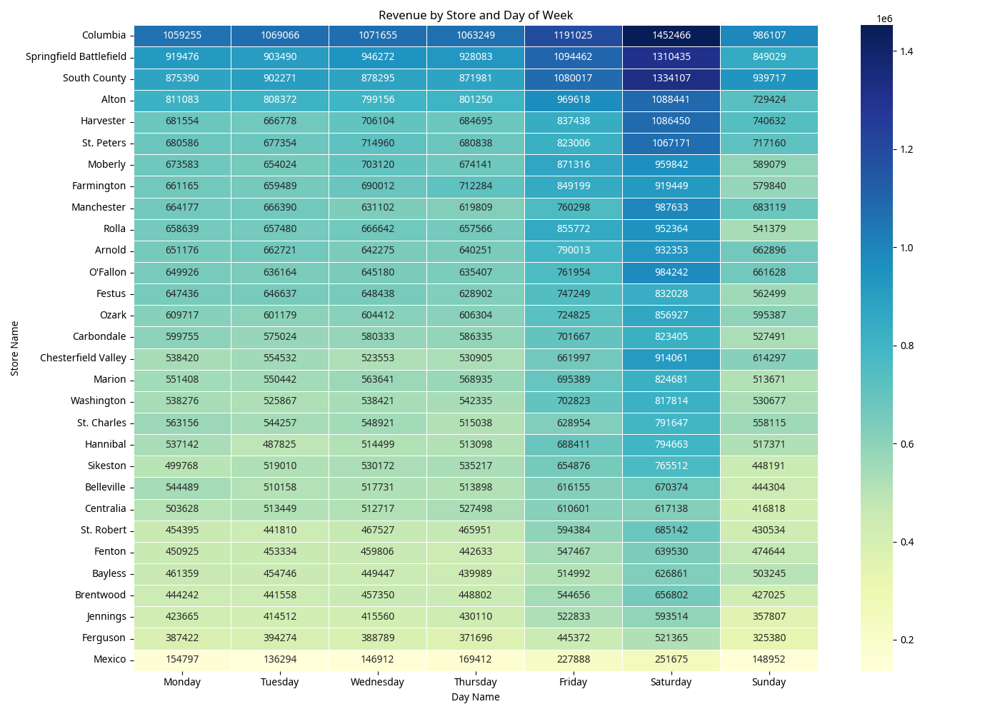
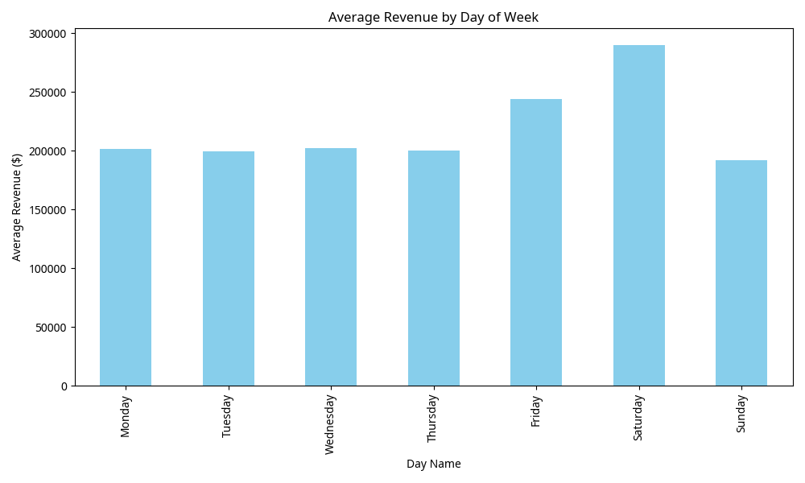
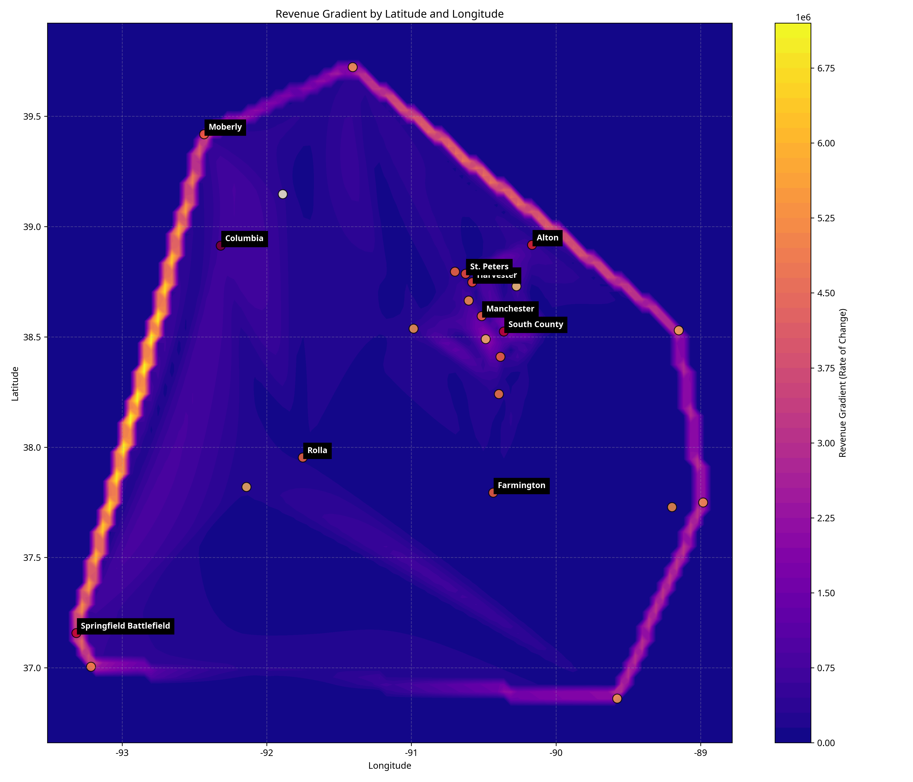

# Retail Store Analysis and New Location Recommendation

## Executive Summary

This report analyzes retail store performance data to determine which store and day of the week generate the highest revenue, and recommends optimal locations for a new store based on comprehensive analysis including geospatial mapping and sensitivity testing.

**Key Findings:**

1. **Highest Revenue Store-Day Combination**: Columbia store on Saturday (,452,466)
2. **Highest Revenue Store Overall**: Columbia (,892,823)
3. **Highest Revenue Day**: Saturday across all stores
4. **Recommended New Store Location**: Area west of St. Robert, Missouri (38.275039, -92.751795)

The recommended location offers the optimal balance of revenue potential and market isolation, positioned to capture underserved areas while benefiting from regional revenue patterns.

## Methodology

Our analysis followed a systematic approach:

1. **Data Integration**: Joined store sales data with geolocation information
2. **Revenue Analysis**: Identified highest-performing stores and days of the week
3. **Geospatial Analysis**: Mapped store distribution and calculated isolation scores
4. **Two-Way Sensitivity Test**: Analyzed how latitude and longitude affect revenue potential
5. **Location Recommendation**: Identified optimal locations based on combined scoring

## Revenue Analysis

### Store and Day of Week Revenue Patterns

Our analysis of revenue by store and day of week revealed that Columbia store generates the highest revenue, particularly on Saturdays. The top 10 store-day combinations by revenue are:

1. Columbia on Saturday: ,452,466
2. South County on Saturday: ,334,107
3. Springfield Battlefield on Saturday: ,310,435
4. Columbia on Friday: ,191,025
5. Springfield Battlefield on Friday: ,094,462
6. Alton on Saturday: ,088,441
7. Harvester on Saturday: ,086,450
8. South County on Friday: ,080,017
9. Columbia on Wednesday: ,071,655
10. Columbia on Tuesday: ,069,066

Saturday consistently generates the highest revenue across all stores, followed by Friday. This pattern suggests that weekend operations should be prioritized in any new store location.

### Top 10 Stores by Total Revenue

1. Columbia: ,892,823
2. Springfield Battlefield: ,951,247
3. South County: ,881,778
4. Alton: ,007,344
5. Harvester: ,403,651
6. St. Peters: ,361,075
7. Moberly: ,125,105
8. Farmington: ,071,438
9. Manchester: ,012,528
10. Rolla: ,989,842

## Geospatial Analysis

We analyzed the geographical distribution of stores and their revenue to identify patterns and potential areas for expansion.

### Distance Analysis

- Average distance between stores: 1.47 degrees
- Closest stores: Jennings and Ferguson (0.036 degrees apart)
- Furthest stores: Springfield Battlefield and Centralia (4.39 degrees apart)

### Isolation Score Analysis

We calculated an isolation score for each store based on its distance from other stores and its revenue. Stores with high isolation scores represent areas with high revenue potential but lower store density.

Top 5 stores by isolation score:

1. Springfield Battlefield: 20.38
2. Columbia: 14.90
3. Ozark: 13.44
4. Moberly: 10.97
5. Marion: 8.68

## Two-Way Sensitivity Test

We conducted a two-way sensitivity test to analyze how latitude and longitude affect revenue potential. This analysis used spatial interpolation to predict revenue across a geographic grid based on existing store locations and their revenues.

We also calculated the revenue gradient to identify areas of rapid revenue change, which can indicate transition zones between high and low revenue potential areas.

By combining revenue prediction with isolation from existing stores, we identified optimal locations for new stores.

## New Store Location Recommendation

Based on our comprehensive analysis, we recommend establishing a new store in the area west of St. Robert, Missouri at the following coordinates:

**Primary Recommendation:**
- **Latitude**: 38.275039
- **Longitude**: -92.751795
- **Combined Score**: 0.5159 (highest of all potential locations)
- **Nearest Existing Store**: St. Robert (Distance: 0.7621 degrees)

**Alternative Locations:**

**Alternative 1:**
- **Latitude**: 38.110260
- **Longitude**: -92.943106
- **Combined Score**: 0.5154
- **Nearest Existing Store**: St. Robert (Distance: 0.8533 degrees)

**Alternative 2:**
- **Latitude**: 37.978437
- **Longitude**: -92.990934
- **Combined Score**: 0.5126
- **Nearest Existing Store**: St. Robert (Distance: 0.8649 degrees)

### Rationale for Recommendation

The recommended location west of St. Robert offers the optimal balance of revenue potential and market isolation. This area is sufficiently distant from existing stores to avoid cannibalization while benefiting from regional revenue patterns observed in our analysis. The location's high combined score indicates strong potential for success based on both revenue projections and strategic positioning.

### Operational Recommendations

Based on revenue patterns across existing stores, we recommend:

1. **Prioritize Weekend Operations**: Ensure full staffing and inventory for Saturday and Friday
2. **Location-Specific Strategy**: The recommended location should follow the operational model of high-performing stores like Columbia
3. **Market Testing**: Consider pop-up operations in the recommended area before full store development

## Conclusion

Our analysis has identified Columbia store on Saturday as the highest revenue-generating store-day combination. Based on comprehensive geospatial analysis and sensitivity testing, we recommend establishing a new store west of St. Robert, Missouri, which offers the optimal balance of revenue potential and market isolation.

We recommend proceeding with site evaluation and market testing in this area, with particular attention to weekend operations which drive the highest revenue across our store network.
